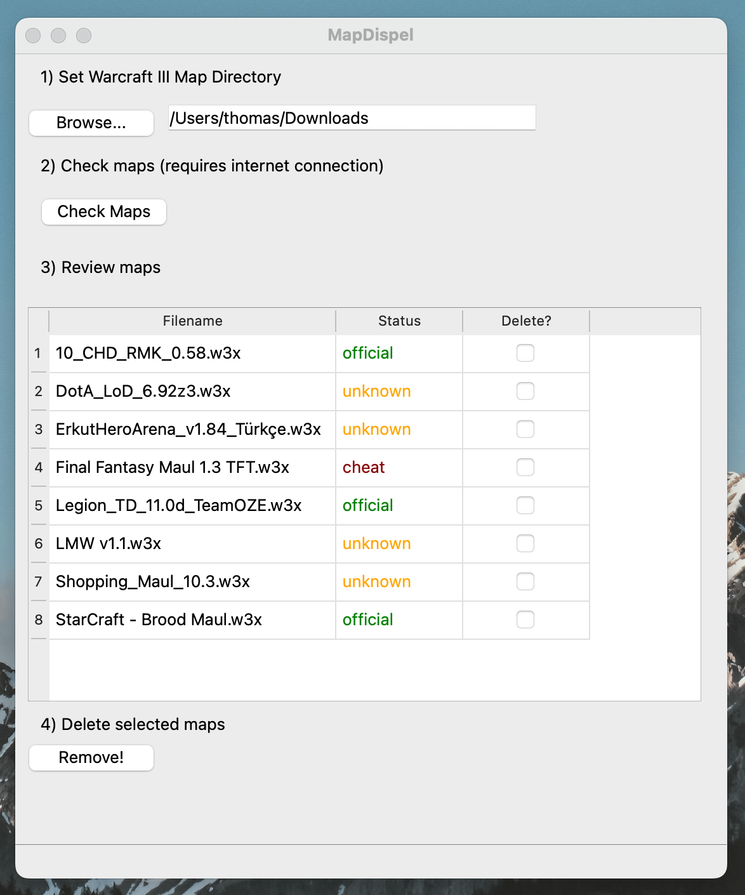

# MapDispel

Warcraft III official map detector

## Using

Download the latest version for your system on the [Releases](https://github.com/ThomasThelen/MapDispel/releases) page.

- Maps that have been detected as official maps are in green
- Maps that couldn't be verified are in orange
- Maps that were detected to have been tampered with are in red

